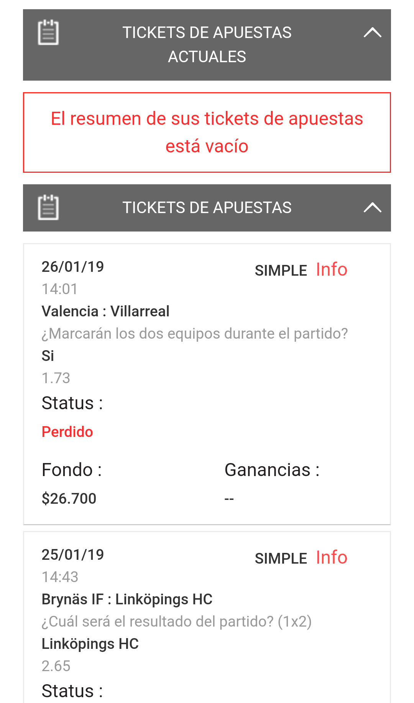
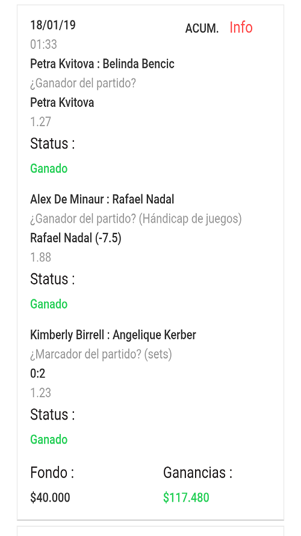
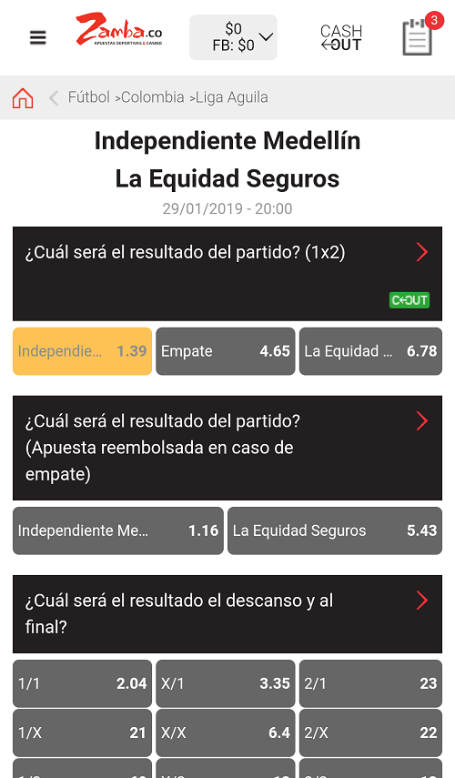
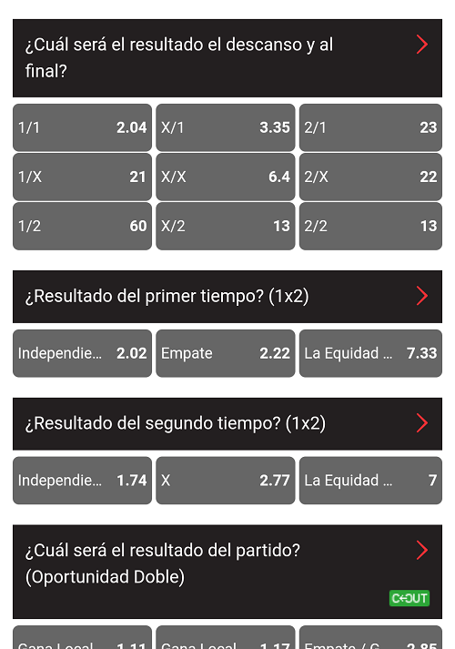

# web_dev
Introducción al desarrollo web

# PROYECTO DEL CURSO DE DESARROLLO WEB

## Idea: 
La idea que se plantea desarrollar es el diseño de una página web
dirigida a las apuestas deportivas. Se pretende ofrecer distintas
modalidades de apuestas y una cantidad considerable de deportes y
ligas. 

## Caracteristicas principales:

- Sistema de depósito y retiro
- Sistema de control de apuestas [actualues e histórico]
- Sistema de control de dinero [histórico]
- Presentaciòn de estadísticas
- Apuestas en vivo

## Algunos ejemplos

### Crear de ticket de apuestas:

### Historial de apuestas:

### Historial de apuestas:

### Variedad de apuestas

