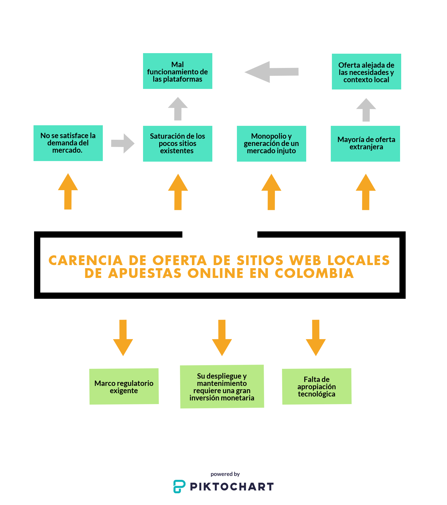
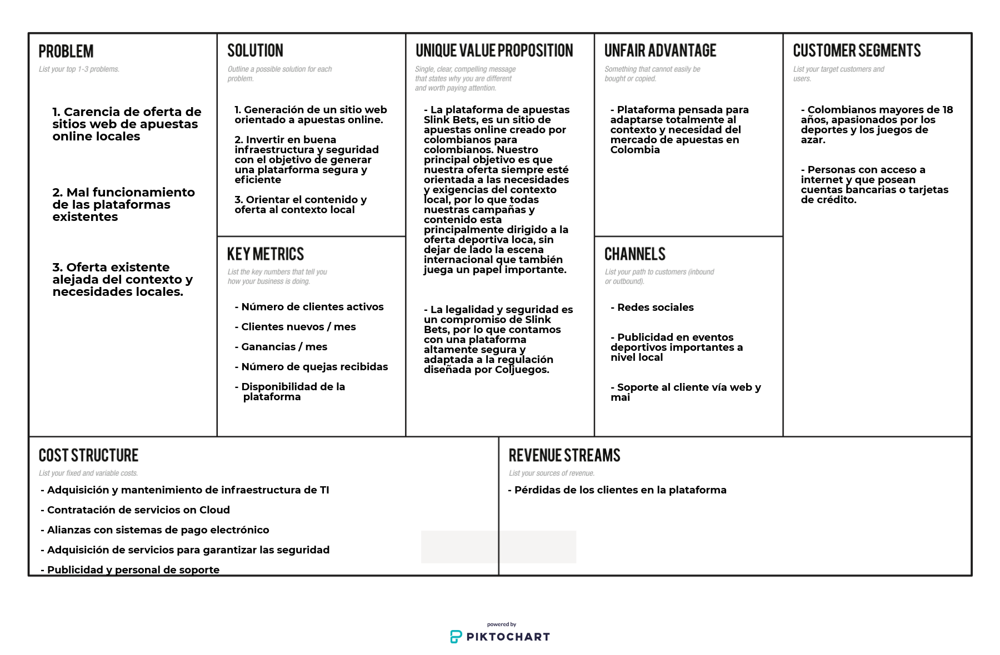
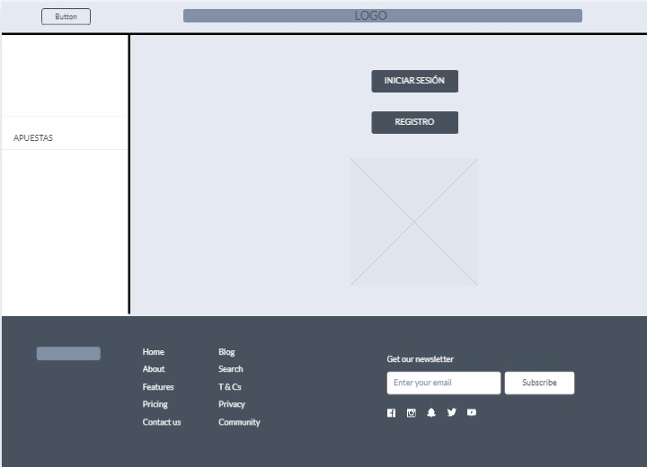
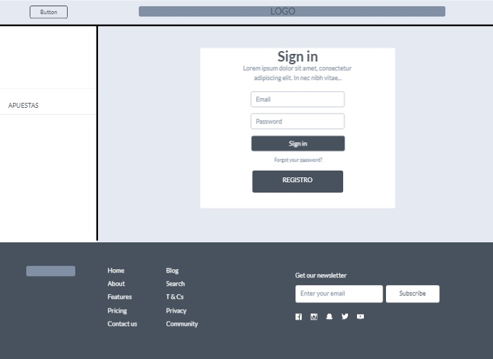
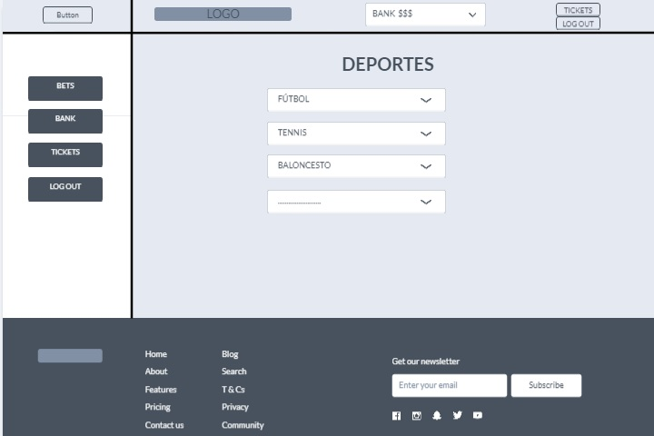
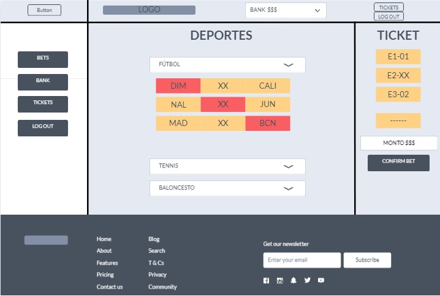
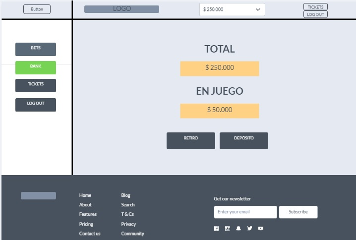
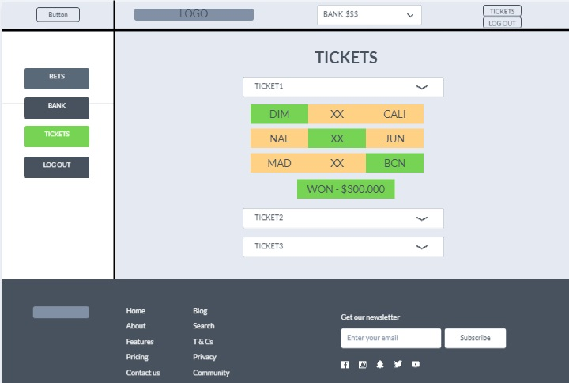

# web_dev
Introducción al desarrollo web

# PROYECTO DEL CURSO DE DESARROLLO WEB

## SLINK BETS [Sitio web de apuestas online]

## 1. Introducción

Las apuestas deportivas consisten en apostar en un subconjunto de resultados de eventos deportivos aleatorios, cada uno de los cuales está asociado con un beneficio correspondiente predefinido por un corredor de apuestas, que en este caso sería la casa de apuestas como tal. Si el resultado se adivina correctamente, el apostador vuelve a ganar la  cantidad apostada más la ganancia, de lo contrario pierde la apuesta y esto se traduce en un beneficio para el corredor de apuestas. Por ejemplo, la casa de apuestas puede definir que la cuota asociada a que un equipo de fútbol gane un encuentro tiene un valor de 2; en caso de que una persona realice una apuesta a este equipo y el resultado sea satisfactorio, el apostador ganaría una cantidad equivalente al doble de dinero invertido en la apuesta y la casa no tendría beneficios.

Históricamente, los corredores de apuestas operaban tiendas de apuestas, pero con la expansión de Internet, la mayoría de los correadores se han actualizado y operan en línea a través de sitios decicados al mercado de apuestas. En estos se ofrece una variedad de oportunidades de apuestas, además de una alta gama de deportes e incluso deportes electrónicos (e-sports). Lo más común es encontrarse con una amplía oferta de eventos deportivos disponibles para realizar apuestas enfocadas a diferentes deportes como fútbol, tenis, baloncesto, beisbol, fútbol americano, rugby, fútbol sala, tenis de mesa, volleyball, hockey, boxeo, UFC, balonmano, golf, ciclismo, entre otros.

El universo de las apuestas deportivas, como cualquier otro negocio, tiene unos términos asociados que es importante conocer para poder entender de una mejor manera las dinámicas y funcionamiento del mismo. A continuación, se presenta una lista de los términos más comunes en el tema de apuestas y su correspondiente definición:

- Ticket: Es un físico o virtual en el cual se resumen las apuestas realizadas en un determinado momento y se muestra información acerca de los eventos, elección, cuota asociada, posibles ganancias, entre otros.

- Apuesta combinada: Selección de pronósticos para varios eventos en una misma apuesta. El valor de cada cuota se multiplica generando una cuota final.

- Apuesta simple: Un solo pronóstico para un evento concreto.

- Couta: valor de ganancia asociado a un evento.

- Stake: cantidad de dinero apostada. Los stakes siempre se gradúan en una escala del 1 al 10.

- Bookmaker: Casa de apuestas (en inglés).

- Apuesta en directo (o livebet): Son apuestas en eventos que se están disputando en tiempo real. Las cuotas varían durante el transcurso del evento, ya que dependen única y exclusivamente de la evolución de este.

- Límite: Cantidad máxima de eventos que se pueden incluír en un ticket de apuestas o cantidad máxima de dinero que se le puede destinar a un evento determinado. Esto lo hacen las casas de apuestas para cuidarse de pérdidas significativas.

## 2. Tema

Una apuesta deportiva es una modalidad de apuestas en la que se intenta predecir los resultados de una competición deportiva. La legalidad y la aceptación general de estas apuestas deportivas varía de país a país. El país pionero en las apuestas de todo tipo, sobre todo carreras de caballos y carreras de galgos ha sido el Reino Unido, también son muy populares las apuestas de boxeo profesional en algunas ciudades de Estados Unidos. En Colombia también son populares las apuestas de Fútbol Profesional Colombiano.

Desde el año 2002 se está llevando a cabo toda una expansión de casas de apuestas virtuales, centradas en apuestas deportivas, que está llegando los países de todos los continentes.Las casas de apuestas online nos ofrecen un número muy extenso de posibilidades de apuestas en todo tipo de eventos deportivos. Podemos encontrar diferentes tipos de apuestas: simples, combinadas, a corto plazo, en directo o live, a largo plazo, entre otras. La migración de las casas de apuestas al entorno de la web, ha hecho que este mercado crezca de gran manera, debido a que se convirtieron en un elemento de fácil acceso y que ofrece un componente importante que atrae muchos clientes y es el hecho de tener la posibilidad de generar dinero a través de las mismas.

Colombia no se ha quedado atrás en este tema y actualmente en el país se tiene una buena oferta de sitios web de apuestas y además es uno de los paises pioneros en el tema de regulación para este tipo de actividades que se pueden prestar para llevar a cabo maniobras ilegales, en la medida en que son negocios que mueven cantidades de dinero muy altas. De esta manera, este tema de las apuestas, que se realizaba en ocasiones de manera clandestina o en locales físicos dispuestos por corredores de apuestas, ha tenido una evolución gigante, hasta el punto de migrarse casi que totalmente a la virtualidad, pudiendo llegar cada vez a un público mayor. Uno de los ejemplos de exito más grandes en el país en este tema es el de la plataforma Wplay que ha tenido una evolución exponencial, llevándola a crecer hasta en un 260%.

## 3. Planteamiento del Problema

Colombia es un país donde la pasión por el juego y las apuestas deportivas no para de crecer. Hace varios años el mercado se estaba expandiendo de manera descontrolada sin tener en cuenta la opinión de Coljuegos, la entidad estatal encargada de repartir las licencias y controlar que todas las casas de apuestas cumplan con la ley en materia de seguridad y protección de datos. Sin embargo esta entidad ha cogido las riendas de la nueva regulación para el juego online, estrenada a finales de 2017 y que puede ser todo un modelo para los países del entorno.

A partir de la creación y publicación de esta regulación, muchos de los sitios que estaban acostumbrados a operar de manera tranquila en el país, tuvieron problemas para acogerse a la misma y fueron declarados ilegales, siendo bloqueado el acceso a los sitios web dentro del país. De esta manera, el mercado de apuestas en Colombia afrontó una crisis transitoria, mientras los sitios existentes lograban ajustarse a lo exigido en materia de regulación. Dicho proceso ha sido largo y redujo considerablemente la cantidad de oferta de sitios web, con el agravante de que la mayoría de sitios que sobrevivieron no pertenecian al entorno local, a excepción de algunos casos como Wplay.

El hecho de que actualmente estemos poblados de una oferta en su mayoría extranjera, genera problemas para los usuarios ya que la mayoría de estas casas no están adaptadas a la realidad y el entorno local, creando descontento por parte de los usuarios. Los principales inconvenientes se deben a temas realacionados con el método de retiro y depósitos que ofrecen estas casas de apuestas, ya que implica la conversión a moneda extranjera y esto puede generar costos adicionales. Además, dado que estas casas no son fundadas en el país, no lo ven como parte de sus prioridades, lo que genera que se preste un mal servicio en general. Otra problematica que se presenta a raíz de tener mayoría de oferta no local, es que estas casas de apuestas no están muy enteradas de las dinámicas del mercado en el páis, por lo que les cuesta ofrecer contenido personalizado que se ajuste a las necesidades de los clientes locales.

De esta manera, se parte de la necesidad de la creación de oferta local, con el objetivo de satisfacer todas las necesidades generadas por el contexto y realidad colombiana, en materia del mundo de las apuestas deportivas. Además, que esté debidamente acogida a la regulación diseñada por Coljuegos, que ofrezca garantía en temas de seguridad, que genere contenido de mercadeo orientado al los clientes locales y que brinde una buena experiencia de atención y soporte al cliente. Un ejemplo claro de una casa de apuestas que se adapta de buena manera a estas necesidades es el caso de Wplay, que genera contenido adaptado totalmente al contexto del país, e incluso piensa en expandir sus modalidades incluyendo apuestas de temas politicos.

- Árbol del problemma

## 4. Justificación

La plataforma Slink Bets es una plataforma que nace con el objetivo de resolver las necesidades encontradas dentro del contexto colombiano, en materia de apuestas deportivas online. De esta manera se plantea la creación de un sitio web de apuestas deportivas con las siguientes características:

- Que cumpla con los lineamientos entregados por Coljuegos, lo que le permitirá operar de manera legal en todo el territorio colombiano.

- Oferta comercial enfocada en el mercado colombiano (ligas deportivas locales)

- Amplia oferta de métodos de pago, para dar mejor servicio al cliente.

- Lineamientos de seguridad estrictos, para garantizar la integridad de los datos.

## 5. Estado del Arte

Colombia es un país donde la pasión por el juego y las apuestas deportivas no para de crecer. Actualmente existe
una amplía oferta de sitios web dedicados al mundo de las apuesta deportivas, algunos de los más famosos son:

### Rivalo:

La casa de apuestas y juego online Rivalo fue lanzada en 2013 gracias al empuje de 247 Sports Interactive B.V., una compañía registrada y con licencia de juego de Curaçao. Esta web, también conocida por su oferta de juegos de casino y azar, dispone de un amplio registro de apuestas y mercados de apuestas deportivas (un jugador tiene la opción de apostar en más de 22.000 opciones) organizadas en 25 grupos que incluye las principales modalidades deportivas, deportes virtuales, dardos, snooker, apuestas políticas y apuestas especiales. El único software es NetEnt, muy prestigioso, especialmente en juegos online, y que aporta lustre a la marca

Seguridad

Rivalo cuenta con una licencia de juego que Curaçao, bajo el número de licencia 5536/Jaz. Es decir, que las apuestas son tratadas, vigiladas, organizadas y procesadas en Curaçao, además del lógico pago de impuestos por apuestas en dicha zona caribeña.
Por otro lado, la web cuenta con una web específica para cuestiones de seguridad en la red y evitar casos como el phising. Sin olvidar la guía de protección de datos del cliente/jugador. La información sensible está protegida y el sistema cuenta con un protoclo criptográfico para garantizar la seguridad.

Banca

La lista de métodos es limitada en comparación con otras casas de apuestas, pero los disponibles son de los más usados y también regulados en la mayoría de países. Para los depósitos se puede depositar un mínimo de 10€ y un máximo de 5.000€ (o divisa equivalente) en monederos electrónicos Skrill, Skrill 1-Tap y Neteller, en EcoPayz y en tarjetas Visa. El importe mínimo en MasteCard es el mismo, pero no ofrece un límite de depósito. Paysafecard (mínimo 1€, máximo 1.000€) y Bitcoin (mínimo 1€ y máximo 50.000€) también son válidos. El tiempo de transacción en todos ellos es inmediato (Bitcoin 1h ). Las transferencias bacanrias pueden tardar entre 3 y 7 días hábiles y establece un depósito minimo más alto: 25€.

Respecto a los retiros, no hay comisiones en los tres primeros reintegros semanales. Si la cifra aumenta, hay comisiones de 1€ en Skrill y Neteller, en tarjetas de crédito, prepago y transferencias bancarias y de 10€ en Bitcoin. El importe mínimo de reintegro es de 10€ en Paysafecard, Visa, MasterCard y Bitcoin; de 25€ en transferencias y de 1€ en monederos. En cuanto a los límites: 15.000 en tarjeta prepago, 10.000€ en e-wallets, 100.000 mil € en banco/banca electrónica, 50.000€ en Bitcoin y 15.000€ en tarjetas de crédito.

### Zamba:

La casa de apuestas Zamba.co pertenece a la sociedad colombiana conocida con el nombre de E’ Total Gaming. Ésta nace de unión de dos grandes compañías dentro del sector del juego. Por un lado, Vicca Group, que es una de las empresas más importantes dentro de la industria del juego presencial en Colombia y, por otro lado, Gaming1, una compañía belga con gran experiencia en el sector de las apuestas online.

Actualmente Zamba.co ofrece servicios de apuestas deportivas y casino a través de una página web completamente autorizada por el gobierno colombiano. Es una propuesta nueva que tiene mucho que ofrecer. En esta reseña te explicamos todas las características y posibilidades de la casa de apuestas Zamba.co.

Seguridad

La casa de apuestas Zamba.co se toma muy enserio todos los aspectos relacionados con la seguridad y la protección de datos de sus clientes. Si no fuera así, no habría sido capaz de conseguir una de las licencias de juego expedidas por el gobierno de Colombia, más concretamente por la entidad Coljuegos.

Por lo tanto, podemos decir alto y claro que la casa de apuestas Zamba.co es un portal de juego legal y seguro en el país. Prueba de ello son los sellos de certificación que se encuentran al pie de página de su web. Asimismo, si estás interesado, también puedes consultar el contrato de Coljuegos que se encuentra adjunto en la web de esta casa.

Banca

La casa de apuestas Zamba.co se asegura de que puedas depositar y retirar fondos de forma segura mediante diferentes modalidades de pago. Entre ellas se encuentran PayU, Efecty, Via Baloto o las tarjetas de crédito y débito Visa y MasterCard. Como podéis ver, muchos de estos métodos de pago están dirigidos al público colombiano. Asimismo, en esta casa de apuestas, la principal moneda para realizar cualquier tipo de operación son los pesos (COP).

Elige la opción que mejor se adapte a ti y utilízala para depositar y retirar dinero sin riesgo. Por otro lado, si tienes alguna duda sobre el funcionamiento de estos métodos de pago no dudes en ponerte en contacto con el personal de Zamba.co.

### Codere:

Codere es la casa de apuestas oficial del Real Madrid y eso le da mucho caché a esta marca. Se trata de una empresa nacional cuya sede se encuentra en Madrid y que cuenta tanto establecimientos físicos como una web de apuestas online. Codere es una marca totalmente legal en España, pues cuenta con la certificación de la DGOJ. Asimismo, su página web es una de las más completas del mercado, con una oferta de deportes difícilmente igualable entre la que se encuentran algunas modalidades que no tan frecuentes como por ejemplo las carreras de caballos, los e-Sports o la política.

En este artículo vamos a realizar la reseña de Codere y para ello nos centraremos en sus características y servicios. De esta forma, podrás decidir por ti mismo si la casa de apuestas Codere se adapta a tus intereses.

Seguridad

La casa de apuestas Codere está autorizada en España por la Dirección General de Ordenación del Juego (DGOJ). Por lo tanto, se trata de un portal regulado y seguro. Además de disponer de la licencia de juego exigida para poder operar en España, esta casa también aplica todas las medidas de seguridad necesarias para poder ofrecer un entorno que fomente el juego responsable. Por este motivo, en la web Codere podrás encontrar algunas de las preguntas que debes hacerte si crees que puedes tener un problema con el juego y también algunos consejos para apostar de forma responsable. Por último, esta marca también permite solicitar la autoexclusión y recomienda algunas páginas de ayuda online.

Banca

Existen dos formas de depositar y retirar fondos en la casa de apuestas Codere. Son las siguientes:

Desde un local presencial: Si prefieres esta modalidad tendrás iniciar sesión en tu cuenta de jugador y seleccionar la opción ‘Depositar en local Codere’. Al hacerlo recibirás un código de barras que deberás presentar en el establecimiento para poder depositar o retirar tu dinero.

A través de la web de Codere: Si prefieres esta alternativa, deberás iniciar sesión en tu cuenta de usuario y seleccionar la opción ‘Depositar’ y seleccionar el método de pago que prefieras. Entre los disponibles están las tarjetas de crédito, las transferencias bancarias, PayPal, Teleingreso y Paysafecard. Deberás tener en cuenta que no todos los métodos de pago permitidos para depositar online están también disponibles para el cobro de tus retiros. De hecho, los únicos métodos que permiten retirar dinero son las transferencias, las tarjetas Visa, PayPal y Hal-Cash.

### Sportium:

Sportium se ha consolidado como una de las casas de apuestas deportivas más conocidas en España. Apareció para el gran público en el año 2013 tras el acuerdo de la empresa española Cirsa y Ladbrokes, una de las firmas con más solera del Reino Unido. El gran crecimiento se debe en parte a la calidad que ofrece: un completo mercado de apuestas deportivas, interesantes bonos de bienvenida y una constante actualización de promociones vinculadas a eventos deportivos, sean puntuales o semanales. Sin olvidar el gran diseño y facilidad de navegación, tanto en web como en móvil.

Se trata de una plataforma autorizada y regulada por la DGOJ, un organismo que pertenece al Ministerio de Hacienda español. Además, esta marca cuenta con su propio canal de televisión: Sportium TV, que se encuentra disponible para sus usuarios desde el año 2014. A través de éste podrás disfrutar de múltiples partidos y eventos deportivos retransmitidos en streaming. Solamente tendrás que haber realizado una apuesta durante ese día para poder disfrutar del canal de Sportium durante las siguientes 24 horas.

Seguridad

Sportium.es es una plataforma de apuestas online que está regulada por la DGOJ, un organismo que pertenece al Ministerio de Hacienda español. Por lo tanto, los jugadores que residan dentro del país podrán acceder a este portal de forma totalmente legal. La seguridad y confidencialidad de los jugadores está protegida en esta plataforma de acuerdo a la Ley de Protección de Datos de Carácter Personal de 1999. De esta forma, Sportium se compromete a tratar tu información personal de forma responsable. Asimismo, en la misma línea de promover una experiencia de juego segura y de calidad, esta casa de apuestas ha adoptado las siguientes medidas de prevención:

-- Límites temporales y económicos
-- Servicios de autoexclusión
-- Consejos y fuentes de ayuda en el caso de necesidad
-- Test de conductas adictivas al juego

Sportium es miembro de ESSA (European Sports Security Association), una organización si ánimo de lucro encargada de la vigilancia de irregularidades y posibles casos de manipulación de apuestas y eventos.

Banca

Los métodos de pago más conocidos están presentes en esta casa de apuestas. Se pueden hacer depósitos mediante una transferencia bancaria, utilizando las tarjetas de crédito/débito Visa, Visa Electrón, Maestro y Master Card, a través de la tarjeta de prepago Paysafecard y mediante las e-wallets Paypal, Skrill y Neteller. La cantidad mínima aceptada es de 10€ y la cantidad máxima es de 10.000€. Excepto en el caso de las transferencias bancarias (2 días hábiles), el periodo efectivo de procesamiento de los depósitos es inmediato.

Para retiros de ganancias, Sportium acepta tarjetas de crédito, los mismos monederos electrónicos, transferencias bancarias y la novedad de poder ir personalmente a uno de los cientos de establecimientos físicos de Sportium que están repartidos en todo el país. La cantidad máxima permitida en un retiro es de 5.000€ , pero se pueden hacer hasta tres al día: un total de 15.000€. En una tienda Sportium el límite es de 500€.

### Wplay:

WPlay.co es la casa de apuestas colombiana por excelencia. ¿Por qué? Porque es la más popular y además fue la primera en obtener la licencia otorgada por Coljuegos, la entidad reguladora de los juegos de azar y apuestas online en Colombia. Es decir, llegó la primera y lo aprovechó.

Se trata de una casa de apuestas creada por colombianos para colombianos. Únicamente tiene licencia para operar en Colombia y solo acepta jugadores residentes en el país cafetero. Esto permite a WPlay.co ofrecer servicios prácticamente personalizados a los colombianos y una atención al cliente mucho más cercana de lo que suele ser normal en las casas de apuestas internacionales y globalizadas.

Obviamente, esto no significa que solo se pueda apostar en competiciones colombianas, ni mucho menos. En WPlay.co se puede apostar en prácticamente todos los eventos deportivos del mundo y por supuesto, también en directo.

Seguridad

Como ya hemos comentado al principio WPlay.co tiene licencia para operar en Colombia otorgada por Coljuegos. Fue la primera en conseguirla, y ello implica que ha pasado todas las auditorias externas necesarias para garantizar de que se trata de una casa de apuestas totalmente segura.

Además, está certificada por Placetopay, Payvalida, y Tucompra, sellos colombianos que aseguran que los métodos de pago usados por WPlay.co son totalmente seguros y fiables.

Para terminar, hay que decir que la web cuenta con certificado de seguridad emitido por la empresa CloudFlare Inc ECC CA-2 lo que también garantiza la seguridad tanto de los usuarios como de los datos personales de estos. La web de WPlay.co ha sido creada en un entorno totalmente seguro.

Banca

El punto negativo de WPlay.co es que no dispone de métodos de pago electrónico. Únicamente es posible recargar dinero en la cuenta mediante Via Baloto o Efecty, es decir, para depositar dinero en la cuenta de WPlay.co hay que ir a uno de estos establecimientos e ingresar dinero en efectivo. Es 100% seguro, por supuesto, pero supone un problema para aquellos usuarios que no vivan cerca de uno de estos establecimientos

### Luckia:

Luckia es una de las casas de apuestas más conocidas en España gracias a su presencia publicitaria en eventos deportivos y televisión. Además, recientemente ha conseguido el Premio eGaming.es al mejor operador de juego online del mercado español. Aparte de su sector de casino y juegos de mesa, destaca principalmente por las apuestas deportivas online y en los locales que tiene repartido en todo el territorio nacional.

Luckia Games S.A. está domiciliada en A Coruña (Galicia) y pertenece al grupo de juego y entretenimiento Egasa, compañía con más de 30 años de experiencia en el sector del gambling y restauración. Tiene licencia para prestación de servicios de juego de la Dirección General de la Ordenación del Juego (DGOJ) del Ministerio de Hacienda: desde 2012 para casino y juegos de mesa; y desde 2013 para explotación de apuestas deportivas.

Seguridad

Sin lugar a dudas, Luckia es una página que ofrece garantías para los jugadores. La empresa que ampara Egasa tiene prestigio en cuanto al servicio y calidad de sus productos. La casa de apuestas gallega está en el mercado al tener una licencia para apuestas y juego online de la DGOJ. Por tanto, cuenta con los sellos de 'Juego Seguro' y 'Jugar Bien'; un indicativo de que la empresa cumple con los estándares de control de juego, seguridad, autoexclusión, protección al jugador, protección al menor y que ofrece herramientas e información para todos aquellos que tienen problemas con el juego. En referencia a la autoexclusión, el sistema permite que puedas cerrar tu cuenta el tiempo estimado. Durante ese período no podrás usar tu cuenta.

Luckia dispone de un sistema cifrado que protege tus datos personales y garantiza la confidencialidad de los mismos: información personal y datos bancarios. Es muy importante porque impide que terceras personas puedan acceder a información sensible. Todo lo referido al uso de datos de caracter personal cumple con la Ley Orgánica 15/1999 (actual LOPD).

Banca

La compañía ofrece una tabla con los métodos de pago disponibles para ingresos y retiros. En el primer caso, puedes dejar dinero en tu cuenta mediante tarjetas de crédito Visa y Master Card (importe mínimo de un euro); tarjeta prepago Paysafecard (importe mínimo de 5€); monederos electrónicos como Skrill Moneybookers y Paypal (importe 5€ ) y transferencias bancarias, con la condición de hacer un ingreso mínimo de 10€  y un proceso de depósito que no es inmediato (1-3 días laborales).

Tanto las transferencias como los monederos son válidos para los reintegros si son cuentas españolas y si fueron usadas también para depósitos. Si la apuesta ha sido realizada mediante tarjeta de crédito o prepago hay que retirar mediante cuenta bancaria. El retiro mínimo permitido es de 10€; mientras que en los depósitos, los límites son de 600€ diarios, 1500€ semanales y 3000€ mensuales.

### Valor agregado de la plataforma Slink Bets:

- Sitio web 100% Colombiano y que se ajusta a la regulación vigente.
- Contenido personalizado adapatado al contexto del país.
- Transferencias y retiros electrónicos.
- Ofrecimiento de aplicativo móvil.

## 6. Objetivo General

Desarrollar un aplicación web, orientado al ofrecimiento de apuestas deportivas en línea. Dicha aplicación estará en capacidad de
ofrecer una gama amplía de opciones para realizar las apuestas deportivas, contará con servicio de creación de usuarios, autenticación, manejo de dinero y administración de apuestas.

## 7. Objetivos Específicos

- Realizar el frontend de la aplicación web, siguiendo las buenas prácticas de desarrollo en HTML y CSS.

- Desarrollar el backend de la aplicación web, teniendo en cuenta las buenas prácticas de desarrollo.

- Realizar la conexión con una base de datos, que permita la administración de usuarios,administración monetaria e historial de apuestas.

- Desplegar el aplicativo web y llevar a cabo pruebas de funcionamiento.

## 8. Modelo de negocio

## 9. Mockups

### 9.1

Página de bienvenida, en la que se da la opción de iniciar sesión o registrarse
en la plataforma

### 9.2

Página de inicio de sesión

### 9.3

Vista de un usuario que inició sesión en la platafora. Se observa el menú
de apuestas

### 9.4

Vista de un usuario que está realizando una apuesta

### 9.5

Resumen bancario de la cuenta

### 9.6

Historial de apuestas realizadas

## 10. Descripción de la aplicación

La idea que se plantea para el trabajo final del curso de introducción al desarrollo web, es la creación, diseño y despliegue
de una aplicación web de apuestas deportivas que tenga características iguales o similares a las de las casas de apuestas online que se encuentran actualmente compitiendo en el mercado.

Se pretende ofrecer distintas modalidades de apuestas y una cantidad considerable de deportes y ligas. Las características principales de la idea a desarrollar son las siguientes:

- Sistema de autenticación y administración de usuarios: Sistema que permita la creación y gestión de cuentas de usuario

- Sistema de depósito y retiro: Sistema de gestión de fondos, que simule el comportamiento de las casas de apuestas online en las cuales se pueden realizar depósitos y retiros desde y hacia cuentas bancarias.

- Sistema de control de apuestas [actualues e histórico]: Funcionalidad que permite revisar las apuestas que se tienen pendientes en la actualidad y el histórico de apuestas realizado en la plataforma.

- Sistema de control de dinero [histórico]: Sistema de control del historial de retiros, depósitos, ganancias y pérdidas.

- Presentación de estadísticas: Presentación de estadísticas de acierto,fallos, ganancias a partir del historial de apuestas.

Para generar la funcionalidad de administración de usuarios, es necesario tener conexión con una base de datos que permita almacenar toda la información correspondiente a un usuario, como lo es: credenciales, temas monetarios, historico de apuestas, entre otros. Además, también se necesita una base de datos global para controlar los eventos deportivos y sus respectivos resultados.

## 11. Bibliografía

- [1]G. Angelini and L. De Angelis, "Efficiency of online football betting markets", International Journal of Forecasting, 2018. Available: 10.1016/j.ijforecast.2018.07.008 [Accessed 5 March 2019].

- [2]O. Hubáček, G. Šourek and F. Železný, "Exploiting sports-betting market using machine learning", International Journal of Forecasting, 2019. Available: 10.1016/j.ijforecast.2019.01.001 [Accessed 5 March 2019].

- [3]"El billonario negocio de las apuestas en línea", El negocio de las apuestas online en Colombia, 2019. [Online]. Available: https://www.dinero.com/edicion-impresa/negocios/articulo/el-negocio-de-las-apuestas-online-en-colombia/263958. [Accessed: 05- Mar- 2019].

- [4]"Los planes de WPlay.co para intentar dominar el mercado colombiano", InfoPlay, 2019. [Online]. Available: http://www.infoplay.info/2019-02-28/los-planes-de-wplayco-para-intentar-dominar-el-mercado-colombiano/7840/noticia/. [Accessed: 05- Mar- 2019].

- [5]E. S.A.S., "WPlay.co crece 260% y se expandirá a apuestas de política y entretenimiento", Larepublica.co, 2019. [Online]. Available: https://www.larepublica.co/empresas/wplayco-crece-260-y-se-expandira-a-apuestas-de-politica-y-entretenimiento-2832476. [Accessed: 05- Mar- 2019].

- [6]"ApuestasDeportivas24 | Las casas de apuestas más fiables 2019", Apuestasdeportivas24.com, 2019. [Online]. Available: https://apuestasdeportivas24.com. [Accessed: 05- Mar- 2019]
